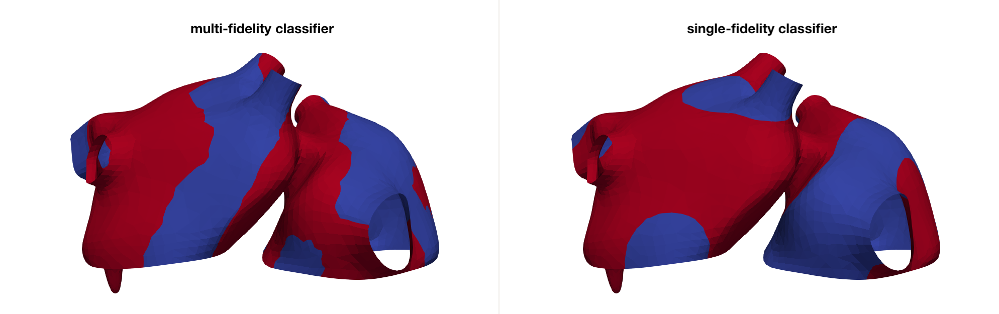

[Try on Google Colab](https://colab.research.google.com/drive/1ijhDpVJZb03Cq-O8xjPtdbwO19DHTPvv?usp=sharing)

# AtrialMFclass

Code for the publication: 

 L. Gander, S. Pezzuto, A. Gharaviri, R. Krause, P. Perdikaris, F. Sahli. [Fast characterization of inducible regions of atrial fibrillation models with multi-fidelity Gaussian process classification](https://www.frontiersin.org/articles/10.3389/fphys.2022.757159/full). Frontiers in Physiology (2022): doi:10.3389/fphys.2022.757159

 ## Abstract

 Computational models of atrial fibrillation have successfully been used to predict optimal ablation sites. A critical step to assess the effect of an ablation pattern is to pace the model from different, potentially random, locations to determine whether arrhythmias can be induced in the atria. In this work, we propose to use multi-fidelity Gaussian process classification on Riemannian manifolds to efficiently determine the regions in the atria where arrhythmias are inducible. We build a probabilistic classifier that operates directly on the atrial surface. We take advantage of lower resolution models to explore the atrial surface and combine seamlessly with high-resolution models to identify regions of inducibility. We test our methodology in 9 different cases, with different levels of fibrosis and ablation treatments, totalling 1,800 high resolution and 900 low resolution simulations of atrial fibrillation. When trained with 40 samples, our multi-fidelity classifier that combines low and high resolution models, shows a balanced accuracy that is, on average, 5.7% higher than a nearest neighbor classifier. We hope that this new technique will allow faster and more precise clinical applications of computational models for atrial fibrillation.

 ## Data and code 

 The geometry and the results of the 1800 high fidelity simulations are in the `data` folder in `.npz` files. The usage of these files is shown in the notebook `test_classifiers.ipynb`, where a multi-fidelity is compared against a single-fidelity case for a given case. 

 The requierements to run the code can installed with:
 ``pip3 install -r requirements.txt``

 
